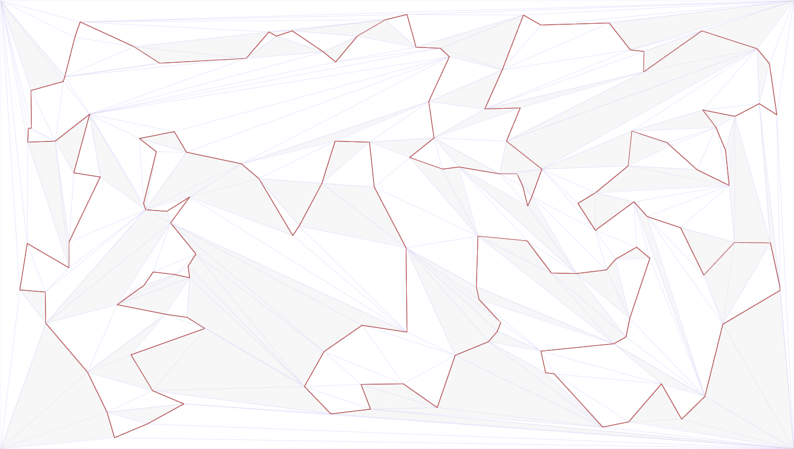

# Triangulated TSP Solver

An experimental solver and visualizer for the Euclidean Traveling Salesman Problem (TSP) that runs entirely in the browser.
You load or generate a set of points, draw a starting tour, and then improve it with tour-improvement moves:
k-opt, double bridge, geometric repair, 4-opt, DBWC and Region Reversal. Small instances can also be solved exactly with
**Exact TSP**.

This is a research prototype. Several buttons are marked *(experimental)* in the interface, and apart from Exact TSP
no method is guaranteed to find the optimal tour.



## How it works

The points are inserted into a custom triangle mesh. It is not a Delaunay triangulation. When a move needs to know
which points can be connected without crossing the tour, the solver does not test the new edge against every tour edge.
It walks through the mesh from triangle to triangle and finds which points are visible from each other. Moves only use
connections found this way, which removes most of the segment-intersection tests. **DBWC** (Delaunay Balanced Window Chain)
works on the tour directly with Delaunay candidate edges. **DBWC Quality** starts from the result of the mesh-based moves.
DBWC, Region Reversal and Exact TSP run in a Web Worker, so the page stays responsive while they search.

## Usage

1. Either paste points as XML into **XML Coordinates**, or tick **Generate Random Vertices** and set **Vertices Count**.
2. Click **Raw Route**. This builds the mesh and draws the starting tour.
3. Click one of the improvement buttons. The report under the buttons shows the tour length and details of the run.

The first line of the report gives the tour length in two ways. *screen* is the length on the canvas. A tiny fixed jitter
is added to every point there for numerical robustness. *metric* is the length on the X/Y values you entered.
If the XML has `MetricX`/`MetricY`, the length in those coordinates is shown as well.

### Input format

```xml
<Points>
  <P X="300" Y="200" />
  <P X="500" Y="300" />
  <P X="700" Y="220" />
  <P X="680" Y="600" />
  <P X="500" Y="480" />
  <P X="320" Y="560" />
</Points>
```

| Attribute | Meaning |
|---|---|
| `X`, `Y` | Required. Position in canvas pixels. The canvas is 1501 × 851; keep the points inside it. |
| `NoktaNo` | Optional. A unique integer ID for the point ("nokta no" is Turkish for "point number"). Give it on every point or on none; without it the points are numbered 1, 2, 3, … in file order. **Copy Points** writes it out. |
| `PolyNo` | Optional. Defaults to `0`; keep it `0` for a TSP tour. |
| `MetricX`, `MetricY` | Optional. Original coordinates, for example from a TSPLIB file. Only used for the extra length shown in the report. |

A `<P>` element whose `X` or `Y` is missing or not a number is skipped, and the report says how many were skipped.
Tour-improvement moves need at least 4 points; with 3 points the tour is already optimal.

The order of the `<P>` elements is the starting tour, so it should not cross itself. DBWC Quality rejects a starting tour
that crosses itself. Random points are ordered by their angle around the center of the point set.

**Copy Points** copies the current points to the clipboard as XML. **Paste Points** pastes XML from the clipboard into
the text box.

## Buttons

| Button | What it does |
|---|---|
| Raw Route | Builds the mesh and draws the starting tour. |
| K-opt Start | K-opt improvement on the mesh. |
| Branched Double Bridge | Double-bridge moves, searched in branches. |
| K-opt + Branched Double Bridge | The two above in sequence. Also called KBDB. |
| Geometric Repair *(experimental)* | Repairs the tour using the visibility data left by KBDB. On a fresh Raw Route it does nothing. |
| Iterative Random Visibility Repair *(experimental)* | Exchanges of up to 6 edges between visible points, tried in random order. Stops after about 130 s at most. |
| KBDB + Geometric Repair *(experimental)* | KBDB followed by Geometric Repair. |
| KBDB + GR + 4opt *(experimental)* | Adds sequential 4-opt moves with a limited search depth. |
| KBDB + GR + 4opt + bridge/deep *(experimental)* | When 4-opt stops improving, tries a bridge move and a deeper move chain. |
| DBWC Fast | Hilbert-curve starting tour, Lin–Kernighan-style moves on Delaunay candidate edges, then a quick DBWC search. No mesh is built; the result is drawn as a light preview. |
| DBWC Quality | The full KBDB + GR + 4-opt pipeline, then the DBWC search. Slower, shorter tours. |
| Region Reversal: time-budgeted / bounded *(research)* | Tries to shorten the current tour by reversing tour segments inside a region. Run DBWC Quality first. The time-budgeted version solves exactly inside a small candidate graph. The bounded version limits its total work to 5000·n^1.7 steps. |
| DBWC time limit (s) | Time limit for DBWC and Region Reversal runs (default 120 s). |
| Full work metering *(slow)* | Counts every step of a DBWC run in a single unit and reports the total. The code is instrumented before it runs, so the run is much slower. |
| Work budget | Stops a metered run after this many million steps. Empty means no limit. |
| Stop DBWC | Cancels a running DBWC or Region Reversal search. |
| Swap Adjacent Blocks | One pass that swaps two neighbouring blocks of up to 4 points each. It applies the best swap it finds. |
| Paired Chain Repair *(slow)* | A deeper repair move built from the visibility data. It can take minutes even for about 75 points. |
| Find Visible (Object Occlusion) | Computes which points are visible from each other in the mesh. |
| Convex Layers / Merge Layers | Builds a tour a different way: splits the points into nested convex hulls, then merges them into one tour. |
| Exact TSP (optimal tour) | Exact branch-and-bound solver for small instances. It stops after 300 s. |

The remaining controls (**Disconnect Selected Point**, **Viewing position**, **K-opt Mode**, **Connect Points**,
**View Occlusion Points**) are for inspecting the mesh.

## Running locally

Web Workers need a web server, so opening `index.html` directly from disk (`file://`) does not work.
From the project folder run one of these:

```sh
npx serve .
```

```sh
python -m http.server 8000
```

Then open `http://localhost:3000` (serve) or `http://localhost:8000` (Python).

## Browser requirements

A current desktop browser with Web Worker support. Development and testing were done in Google Chrome.
Instances with thousands of points can take several minutes. Use the DBWC time limit to cap DBWC runs.

## License

Free for non-commercial use, including research and education. Commercial use is not permitted.
The full terms are in [LICENSE](LICENSE) (PolyForm Noncommercial License 1.0.0).

Copyright (c) 2026 Osman ERTAŞ

## Third-party

[Acorn](https://github.com/acornjs/acorn) (`js/vendor/acorn.js`), MIT License, see
[js/vendor/ACORN-LICENSE](js/vendor/ACORN-LICENSE). Only **Full work metering** uses it.
